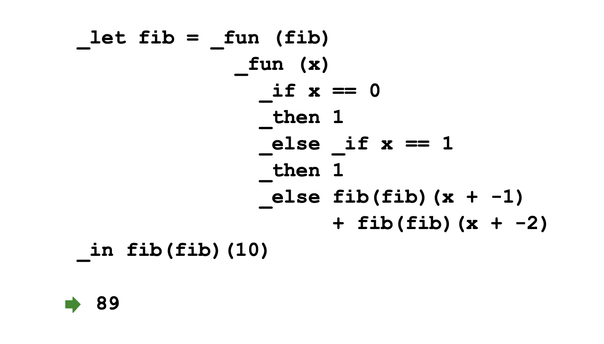
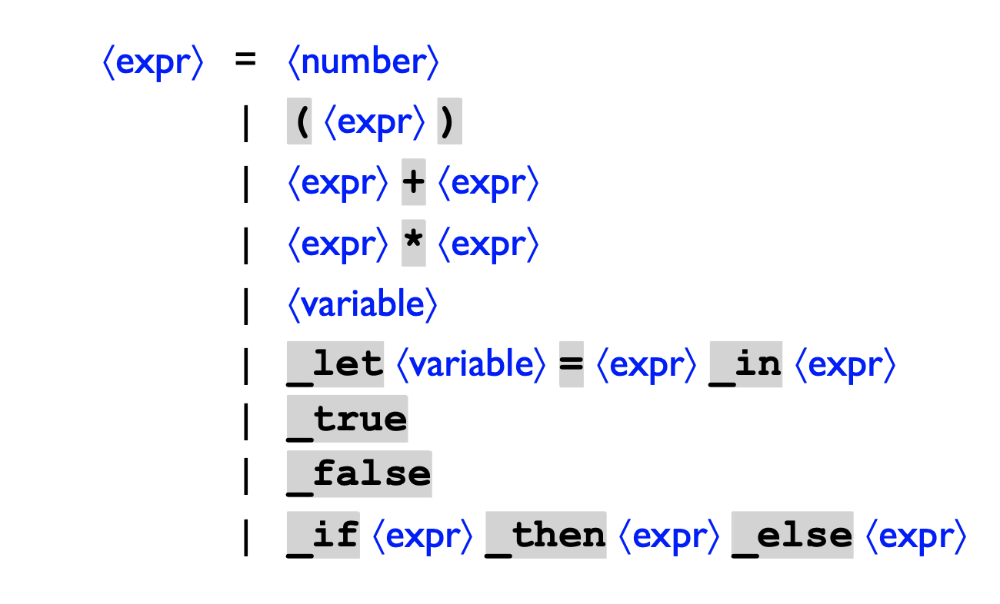
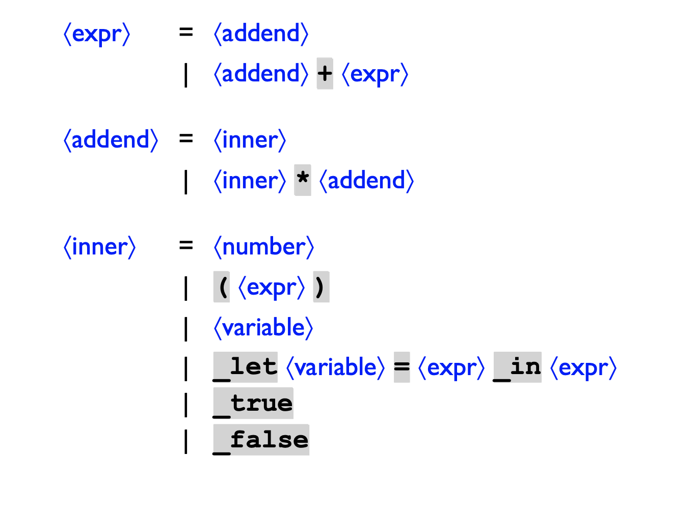

# Interpreter-MSDScript
A basic interpreter for a new programming language-MSDScript. 

* The Syntax of the MSDScript is like this:  

* Functions of MSDScript include: arithmetic/boolean parser, variable binding, functions, explicit continuations.

* Grammar: 

* Parsing Expression:
